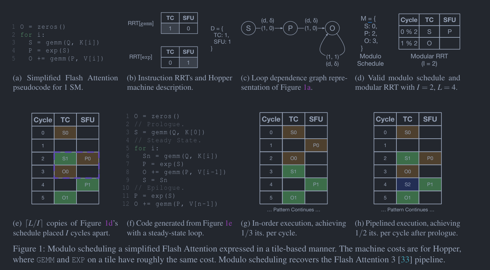

# twill 论文阅读

Owner: Turin alan

# 3.1 模调度

模调度 [22,25,32] 是一类流行的软件流水算法，用于变换给定的循环，使其达到最大吞吐量（单位时间内完成的迭代数），同时遵循输入程序的数据依赖与底层机器的容量限制。在模调度中，输入循环被描述为一个依赖图 G = (V,E)，其中 V 是循环中的指令集合，E 定义指令之间的依赖关系。我们假设 G 描述的是一个不含控制流的单层嵌套循环。在 Twill 中，每条指令代表一个利用整个 SM 资源的瓦片级操作；此类依赖图可以从标准的基于瓦片的编程模型中提取（参见第 5 节）。

每个 v ∈ V 都关联一个资源预留表（RRT），用于指示 v 执行期间所使用的功能单元。RRT[v] 是一个二维整数数组，其中每一列对应一种功能单元，每一行对应 v 执行过程的一个时钟周期，表项给出在该执行时钟周期 v 占用的功能单元 f 的实例数。机器上功能单元 f 的实例总数（称为 f 的容量）由机器描述 D 给出。图 1b 展示了运行示例中各操作的 RRT 以及机器描述 D；两条指令均只需一个周期执行，但占用不同的功能单元。为简单起见，我们假设每个功能单元每个周期都可以调度并执行一条指令；在实际机器上，功能单元执行某些指令通常需要比其他指令更长的时间，且对接受新指令的频率有限制。对于处理大规模数据瓦片的 TC GPU，RRT 的抽象在更粗粒度的计算下仍然有效，此时一个“周期”可能代表更粗粒度的时间。有关如何确定时间粒度的问题，我们将在 5.2 节中讨论。

每条边 e ∈ E 是一个元组 (u,v,d,δ)，其中 u 为数据依赖的源，v 为数据依赖的汇。时钟周期延迟 d ≥ 0 表示 v 必须至少比 u 晚 d 个周期发射。最后，δ ≥ 0 为迭代延迟，表示循环迭代 i 中 v 的实例必须至少比迭代 i−δ 中 u 的实例晚 d 个周期发射。例如，一条 δ = 1 的边表示 u 和 v 之间的依赖是跨迭代传递到紧接着的下一次迭代的。注意力示例的依赖图如图 1c 所示，其中从 S 和 P 出发的边 d = 1（源自相应的 RRT），δ = 0，而关于 O 的循环携带依赖则 δ = 1。为便于阐述，我们在图中使用变量名（这些名字是唯一的）而非指令名。每条指令的 RRT（图 1b）与依赖图 G（图 1c）共同构成模调度的输入。——（先u再v， v[i]比 u[i-delta] 晚d个cycle）

对于给定的循环运行模调度，将求出一个启动间隔 I 和一个模调度方案 M，并据此构造流水化的循环。I 对应新循环迭代发射（或完成）的速率，因而与吞吐量成反比；I = 1 是最小可能值，意味着每个周期发射一个新的循环迭代。M 将每条指令映射到相对于其迭代起始时刻必须发射的时钟周期（故称“模”）。若 M(v) = k，则在流水化循环中，v 将在时钟周期 k, I+k, 2I+k, ... 发射。M 和 I 的选取是有效的，当且仅当它确保流水化循环满足 E 中所有依赖边，并使所有功能单元保持在容量之内。



运行示例的一个有效模调度方案如图 1d 所示。与之配套的是模 RRT，这是一个与 RRT 类似的数据结构，用于指示流水化循环稳态下的功能单元使用情况。在该模调度中，P 和 O 均被推迟了一个周期，比仅考虑单次迭代的最优调度要晚。M(P)=1，M(O)=2 按数据依赖是有效的，但按模 RRT 却是无效的，因为 O 会与 S 在 TC 上发生冲突（0 ≡ 2 mod 2）。目前已发展出多种算法来针对给定的依赖图 G 构造 M 和 I，包括贪心算法 [25,32] 以及利用整数线性规划（ZLP）的最优算法 [22,35]。最优算法能生成具有最小可能 I 的模调度，从而获得最高可能的吞吐量。

一旦找到模调度 M 和启动间隔 I，便可用它们来综合出执行该调度方案的程序。实现模调度的一种标准方法 [6] 是采用一个顺序循环，它由三部分组成：1) 为流水线做准备的序幕，2) 包含反复执行循环体的稳态，以及 3) 排空流水线的尾声。为构造这三个部分，令 L 为 M 的长度，即 M 中的周期数。软件流水循环通过将 ⌈L/I⌉ 份 M 的副本相互重叠来构造，每份副本较前一份偏移 I 个周期。随后即可从这一交错排布中读出流水化循环：前 (⌈L/I⌉−1)·I 个周期对应序幕，接下来的 I 个周期对应循环执行的稳态，其余周期则是排空流水线的尾声。图 1e 展示了运行注意力示例的模调度排布，其中蓝色和紫色分别对应不同的调度副本，虚线方框内为稳态。一旦构造出调度方案，即可用于代码生成。运行示例生成的伪代码如图 1f 所示。按图 1a 所写的顺序执行每 3 个周期完成 1 个循环迭代（图 1g），而流水化执行在序幕之后每 2 个周期即可完成 1 次迭代（图 1h）。

将模调度应用于 Flash Attention 运行示例，仅凭对算法和机器的高层描述，便可得到专家在 Flash Attention 3 [33] 中手工设计的精确流水线。

# 4. Joint Optimization Problem

现在，我们演示如何同时求解寻找模调度方案与线程束特化（WS）策略这一优化问题。该联合优化问题以输入程序 G = (V,E) 为对象，产生一个具有最小启动间隔的模调度方案，以及一个能够实现该调度方案的 WS 策略。其结果包括模调度方案 M∗、启动间隔 I∗ 和线程束分配 A∗，其中 A∗ 为将每个 v ∈ V 分配到一个（或多个）线程束的指派。

我们分两个主要步骤来解决该问题。首先，利用模调度推导出一个初始模调度方案 M 和启动间隔 I，在满足数据依赖与功能单元约束的前提下达到最大吞吐量。然后，以 M 和 I 为初始条件，建立一个约束系统，并补充针对 WS 的约束。该约束系统可交由 SMT 求解器求解，以发现具有相同 I 且同时满足模调度与 WS 要求的 M∗ 和 A∗。

我们使用 M 和 I 定义一个初始的直线程序 Q，并在此之上建立约束系统。Q 通过第 3.2 节介绍的模调度代码生成过程获得。回顾一下，⌈L/I⌉ 份 M 的副本相互重叠，每份相对前一份偏移 I 个周期，从而形成序幕、稳态和尾声三个阶段。我们的洞见在于，可以假设稳态恰好执行一次，从而将这三个阶段视为一个长度为 T 的直线程序。这一假设是可靠的，因为允许稳态恰好执行一次；同时也是完备的，因为各次稳态执行完全相同，并且通过消除任何循环分析的需要，极大简化了约束。图 3 的右半部分展示了一个由图 1 中模调度示例导出的程序 Q 的例子。


## 4.1 带约束的模调度

联合问题的目标是找到一个模调度 M∗，它可能与 M 不同，但达到相同的启动间隔。为此，Twill 必须能够修改 M，这就需要用 SMT 约束的形式重新实现模调度。这一重新实现并非直接修改 M，而是允许将 Q 修改为 Q∗，使得 Q∗ 具有与 Q 相同的启动间隔和长度，但可能是不同模调度的结果。相关约束在图 4 中给出。我们定义一个三维布尔数组，使得 op[v,i,t] 表示操作 v ∈ V 的第 i ∈ [0,⌈L/I⌉) 次迭代在 Q∗ 中被调度到时钟周期 t ∈ [0,T)。唯一性约束强制每个操作恰好被调度一次。一致性约束确保 Q∗ 可从某个模调度得出。完成性约束要求所有操作必须在 Q∗ 的最后一个时钟周期 T 之前完成。最后，依赖约束与容量约束的功能与模调度中对应的约束相同。为简洁起见，我们省略了保护条件，但假设引用了 i ∉ [0,⌈L/I⌉) 的约束不会被生成。此外，对 op 中 t ∉ [0,T) 的引用被映射为假。op 的一个可满足赋值将导出一个有效的 Q∗ 和 M∗，其中当且仅当 op[v,0,t] 为真时，M∗(v) = t。


这张图展示的是计算机体系结构（特别是编译器优化和高卡性能计算）中，**“模调度”（Modulo Scheduling）** 算法的核心数学约束条件。

模调度是一种用于循环展开和流水线化（Software Pipelining）的编译器优化技术。它的目的是让循环的多次迭代（Iterations）在时间上重叠执行，从而最大限度地利用处理器的硬件资源。

以下是图中这 5 个公式的具体含义拆解：

### 1. 唯一性约束 (UNIQUENESS)


- **含义：** 每一项操作（Operation）在单次迭代中**必须且只能**在一个确定的时间点 $t$ 开始执行。
- **解释：** $v$ 代表指令/操作，$i$ 代表循环的第几轮迭代，$\text{op}[v, i, t]$ 是一个布尔变量（真为 1，假为 0）。这个求和公式确保了指令不会被漏掉执行，也不会在同一轮迭代中被重复执行多次。

### 2. 一致性约束 (CONSISTENCY)

$$\forall v, i \in [1, \lceil L/I \rceil), t \quad \text{op}[v, 0, t] \Rightarrow \text{op}[v, i, t + i \cdot I]$$


- **含义：** 后续迭代的指令发射时间，与第 0 次（初次）迭代的指令发射时间保持**固定的时间差（间隔）**。
- **解释：** $I$ 通常代表**起始间隔（Initiation Interval）**，即每隔多少个时钟周期启动一次新的循环迭代。如果第 0 次迭代的某个指令 $v$ 在时间 $t$ 执行，那么第 $i$ 次迭代的相同指令就必须在 $t + i \cdot I$ 的时间点执行。这保证了软件流水的整齐度。

### 3. 完成度/时间界限约束 (COMPLETION)


$$\forall v, i, t \quad t + \text{cycles}(v) > T \Rightarrow \neg \text{op}[v, i, t]$$

- **含义：** 所有的操作必须在**总时间预算 $T$** 之内全部执行完毕。
- **解释：** $\text{cycles}(v)$ 是指令 $v$ 的执行延迟。如果某个指令在 $t$ 时刻启动，加上它的执行时间超出了允许的最大时间 $T$，那么该指令就**不能**在 $t$ 时刻启动（即 $\text{op}$ 为假）。

### 4. 依赖性约束 (DEPENDENCE)


$$\forall i, t, (u, v, d, \delta) \in E, t' \in [0, t + d) \quad \text{op}[u, i, t] \Rightarrow \neg \text{op}[v, i + \delta, t']$$

- **含义：** 严格遵守指令之间的数据依赖或控制依赖关系，**不能“抢跑”**。
- **解释：** 假设指令 $u$ 和指令 $v$ 存在依赖关系（边 $E$），其中 $d$ 是延迟（$u$ 必须执行完 $d$ 个周期后 $v$ 才能用它的结果），$\delta$ 是跨迭代的步长（例如第 $i$ 次迭代的 $u$ 算出的值被第 $i+\delta$ 次迭代的 $v$ 使用）。
    
    如果 $u$ 在 $t$ 时刻执行，那么 $v$ 绝对不能在 $t + d$ 之前的时间 $t'$ 执行。
    

### 5. 硬件容量/资源约束 (CAPACITY)


$$\forall t, f \quad \sum_{v, i, c \in [0, \text{cycles}(v))} \text{op}[v, i, t - c] \cdot \text{RRT}[v][f, c] \le \text{cap}(f)$$

- **含义：** 在任意时钟周期 $t$，所有正在执行的指令所消耗的某种硬件资源（如算术逻辑单元 ALU、访存通道等），**不能超过该资源的实际硬件容量**。
- **解释：** $\text{RRT}$ 是**资源预留表（Resource Reservation Table）**，记录了指令在执行的第 $c$ 个周期需要使用哪些功能部件 $f$。$\text{cap}(f)$ 是硬件能提供的最大并行度。该公式确保编译器排出来的流水线不会导致硬件资源冲突（Structural Hazard）。

### 总结

这套公式通常被输入给 **ILP（整数线性规划）求解器** 或 **SAT/SMT 求解器**。编译器的目标是在满足上述所有约束（保证程序运行正确、不爆硬件）的前提下，寻找一个让总执行时间最小，或者让起始间隔 $I$ 最小的指令调度方案。


图 5 的核心是：**在做 modulo schedule + warp specialization 时，同时检查“活跃数据”会不会超过片上内存容量。**

换句话说，图 4 只管：

> 操作什么时候执行、依赖是否合法、TC/SFU 等 functional unit 有没有冲突。
> 

图 5 额外管：

> 这个调度会不会让太多中间结果同时活着，导致 register/shared memory/Tensor Memory 放不下。
> 

论文这里假设 `Q*` 是 SSA 形式，也就是每个 operation 产生一个唯一结果；然后定义 `live[v,i,t]`，表示 **第 `i` 个 copy 里的操作 `v` 产生的结果，在时间 `t` 是否仍然活着**。作者说这些 liveness 约束不能靠外部静态分析一次性算好，因为 Twill 求解器会改变 `Q*` 的调度位置，调度一变，变量生命周期也会变。

---

## 1. MEMORY CAPACITY：同时活着的数据不能超过内存容量


公式大概是：

```
∀t,m  Σ live[v,i,t] · footprint(v,m) ≤ capacity(m)
```

意思是：

> 对任意时间 `t`、任意 memory 类型 `m`，所有活跃值占用的内存总量不能超过该 memory 的容量。
> 

这里：

- `live[v,i,t] = 1`：说明这个值在时间 `t` 活着；
- `footprint(v,m)`：操作 `v` 的结果在 memory `m` 中占多少空间；
- `capacity(m)`：memory `m` 的容量上限。

所以这条约束就是在问：**某个时刻 register/shared memory/TMEM 中同时保存的东西会不会爆。**

这正是 SWP 在 GPU 上麻烦的地方：软件流水会把多个 iteration 的中间结果同时留在片上，从而增大 working set。

---

## 2. INIT：最后时刻哪些值还活着？

公式：

```
∀v (∃(v,u,d,δ>0) ∈ E) ⇔ live[v, ceil(L/I)-1, T]
```

意思是：

> 在直线程序 `Q*` 的最后时间 `T`，只有那些会被未来 iteration 使用的 loop-carried value 仍然活着。
> 

这里 `δ > 0` 表示 loop-carried dependence，也就是 `v` 的结果不是只被当前 iteration 用，而是会被后面的 iteration 用。

举个直觉例子：FlashAttention 里的累加器 `O`，当前 iteration 更新后的 `O` 会被下一轮继续使用，所以它在展开片段的末尾还得活着。

---

## 3. LIVEPROP-1 / LIVEPROP-2：从后往前传播“活着”

这两条是在做经典的 **backward liveness analysis**。

### LIVEPROP-1

```
live[v,i,t] ∧ op[v,i,t] ⇒ ¬live[v,i,t-1]
```

意思是：

> 如果 `v` 的结果在时间 `t` 活着，并且 `v` 正好在时间 `t` 被产生，那么在 `t-1` 它还没被产生，所以不可能活着。
> 

这个不是在说“两个操作必须间隔一个 cycle”。它只是说：**一个值在定义点之前不存在。**

### LIVEPROP-2

```
live[v,i,t] ∧ ¬op[v,i,t] ⇒ live[v,i,t-1]
```

意思是：

> 如果 `v` 的结果在时间 `t` 活着，而且 `v` 不是在 `t` 这一刻才产生的，那么往前一个时刻 `t-1` 它也应该活着。
> 

也就是：**只要没有走到定义点，liveness 会向前传播。**

---

## 4. DEADPROP-1 / DEADPROP-2：从后往前传播“死了”

这两条是跟上面互补的，传播 deadness。


### DEADPROP-1

```
¬live[v,i,t] ∧ OR op[u,i+δ,t] ⇒ live[v,i,t-1]
```

其中 `(v,u,_,δ) ∈ E`，说明 `u` 使用了 `v` 的结果。

意思是：

> 如果 `v` 的结果在时间 `t` 之后已经死了，但时间 `t` 正好有某个 consumer `u` 在使用它，那么在 `t-1`，`v` 必须是活着的。
> 

这个也不是说“如果 `(v,u)` 存在，那么 `v` 结束后立即开始 `u`”。更准确地说：

> **一旦某个 use 发生在时间 `t`，那么 producer 的结果在这个 use 之前必须 live；use 之后如果没有其他 use，就可以 dead。**
> 

比如 `S0` 被 `P0 = exp(S0)` 使用。那么在 `P0` 执行之前，`S0` 必须活着；`P0` 执行之后，如果没人再用 `S0`，`S0` 就可以死掉。

### DEADPROP-2

```
¬live[v,i,t] ∧ AND ¬op[u,i+δ,t] ⇒ ¬live[v,i,t-1]
```

意思是：

> 如果 `v` 的结果在时间 `t` 是死的，而且时间 `t` 没有任何 consumer 使用它，那么往前一个时刻 `t-1` 它也还是死的。
> 

也就是：**deadness 会向前传播，直到遇到某个 use。**

---

一句话总结：**图 5 是 Twill 用 SMT 表达 liveness analysis + memory capacity check。它让求解器不只找“功能单元不冲突”的流水线，还要找“中间结果放得下”的流水线。**

你图上关于 DEADPROP 的批注可以稍微改一下：它不是要求 `v` 结束后立即开始 `u`，而是要求 **如果 `u` 在某个时间点使用 `v` 的结果，那么 `v` 的结果在使用前必须 live，使用后才可能 dead**。


图 6 的核心意思是：**Twill 不只是决定“每个操作在哪个时间执行”，还要决定“每个操作由哪个 warp 执行”。**

前面图 4 是 schedule 约束，图 5 是 memory/liveness 约束；图 6 则是 **warp specialization 约束**。它把 WS 里面几个现实问题塞进 SMT：warp 分工、variable-latency 操作放哪、寄存器够不够、跨 warp 通信成本、blocking sync 会不会打断同一个 warp 上的其他操作。

---

## 0. 新变量：`opw[v,w]`

图 6 先定义了一个布尔变量：

```
opw[v,w] = true / false
```

意思是：

> 操作 `v` 是否分配给 warp `w` 执行。
> 

所以 Figure 4 里的 `op[v,i,t]` 回答的是：

> `v` 的第 `i` 个实例在时间 `t` 执行吗？
> 

Figure 6 里的 `opw[v,w]` 回答的是：

> `v` 是由哪个 warp 执行？
> 

最后 Twill 要求解的结果其实就是：

```
时间调度 M*
+
warp assignment A*
```

也就是 **什么时候执行 + 谁来执行**。

---

## 1. WARP UNIQUENESS：每个操作只能分配给一个 warp

公式：


```
∀v  Σ_w opw[v,w] = 1
```

意思是：

> 每个 operation `v` 必须被分配到且只分配到一个 warp。
> 

当然论文也说，这个约束可以自然扩展到需要多个 warp 协作的操作，比如 Hopper/Blackwell 上某些 warp-group 级别的 Tensor Core 操作。

直觉上就是：**别让一个普通操作没人做，也别让多个 warp 重复做同一个普通操作。**

---

## 2. VARIABLE LATENCY：可变延迟操作放到专门 warp


公式大意：

```
variable_latency(v) ⇔ opw[v, Wvl]
```

意思是：

> 如果 `v` 是 variable-latency operation，就把它分配给专门的 variable-latency warp `Wvl`。
> 

这里对应前文说的一个问题：某些操作执行时间不稳定，比如 TMA load、global memory 相关搬运，实际耗时可能波动很大。把它们跟固定 latency 的 GEMM/EXP 静态排在一起，很容易导致 pipeline stall 或 under-utilization。

所以 Twill 的策略是：

> **把可变延迟操作隔离到专门 warp 上，让它们不要污染主计算流水线的静态调度。**
> 

这就是 Figure 6 第二条约束的意义。

---

## 3. REGISTER LIMIT：每个 warp 的寄存器不能爆


公式大意：

```
∀t,w  Σ live[v,i,t] · opw[v,w] · regs(v) ≤ reg_limit()
```

意思是：

> 在任意时间 `t`，对任意 warp `w`，所有分配给这个 warp、并且此刻还活着的值，占用的寄存器总数不能超过寄存器上限。
> 

这里把图 5 的 `live[v,i,t]` 用上了。

图 5 只是在算：

> 某个值此刻是否 live。
> 

图 6 进一步问：

> 这个 live value 属于哪个 warp？会不会让这个 warp 的 register pressure 爆掉？
> 

这点很重要，因为 SWP 会让多个 iteration 的中间结果同时活着。哪怕全 SM 的寄存器总量看起来够，**某一个 warp 自己的寄存器也可能不够**。

---

## 4. CROSS-WARP SPILLS：跨 warp 使用数据要付通信成本


公式看起来复杂，但含义很简单。

如果有依赖边：

```
u -> v
```

并且：

```
u 分配给 warp w
v 分配给 warp w'
w != w'
```

那么 `v` 不能像同 warp 那样马上读取 `u` 的结果，因为：

> 一个 warp 的 register 不能被另一个 warp 直接访问。
> 

所以数据必须通过 shared memory 或类似机制转一手。论文把这个额外代价叫做 `spillcost(u)`。

直觉是：

```
同一个 warp:
u 产生结果 → v 直接用

不同 warp:
u 产生结果 → 写到 shared memory / 同步 → v 再读
```

所以 `v` 的调度时间必须额外延后，不能只满足原始 dependency latency `d`，还要满足 cross-warp communication 的延迟。

这条约束就是在迫使求解器权衡：

> 把 `u` 和 `v` 放在不同 warp 可能降低 register pressure 或避免 blocking sync，但会引入跨 warp 通信成本。
> 

这也是 Twill 要“联合优化 SWP 和 WS”的关键原因之一。

---

## 5. CONCURRENCY：blocking sync 会打断同一个 warp 上的并发操作


最后一条是 Figure 6 里最有 GPU 味的一条。

如果某个操作 `v` 在执行前需要 blocking synchronization，比如：

```
等待 GEMM 结果
等待 TMEM load
等待 shared memory 通信完成
```

那么由于 GPU thread/warp 是 **in-order issue**，这个 wait 会阻塞同一个 warp 后续指令的发射。

所以 Figure 6 的 concurrency constraint 大意是：

> 如果 `v` 在时间 `t` 需要 blocking sync，并且 `v` 被放在 warp `w` 上，那么同一个 warp `w` 上不能还有另一个操作 `o` 在这个时间附近并发执行。
> 

这对应前面 Figure 2 的例子：GEMM、EXP、ADD 理论上用不同 functional unit，可以并发；但如果 ADD 前面有 `GEMM.WAIT`，而 EXP 又在同一个 warp 上，`GEMM.WAIT` 会打断 EXP 的 issue。解决办法就是把这些操作分到不同 warp 上。

所以这条约束是在告诉 solver：

> 不要把会被 blocking sync 打断的操作安排在同一个 warp 上重叠执行。
> 

---

一句话总结：**图 6 是 Twill 对 warp specialization 的建模。它让 solver 自动决定哪些操作放在哪些 warp 上，同时考虑 variable latency、寄存器压力、跨 warp 通信成本、blocking synchronization 对并发 issue 的破坏。**

最关键的洞见是：WS 不是一个后处理优化，而是必须和 SWP 一起求解。否则你可能先找到一个理论上 TC/SFU 利用率很高的 modulo schedule，但最后发现：寄存器放不下、跨 warp 通信太贵、或者 wait 把同 warp 的并发操作全打断。

# 5 实现

为了具体实现我们的方法，我们推出了 Twill，一个为 Triton [36] 程序计算联合软件流水（SWP）与线程束特化（WS）策略的系统。Twill 从名为 TTGIR 的中层 Triton 中间表示（IR）中提取依赖图，该 IR 是一种基于瓦片的静态单赋值（SSA）IR，具有瓦片上的算术运算和显式的数据移动。这些依赖图作为 Twill 优化过程的输入程序（如第 4 节所述）。Twill 的用户还必须向系统指明目标 GPU 架构。目标架构用于估算指令和数据移动的开销（可通过文档 [1] 或直接测量获得），并支持针对特定架构的建模，例如声明可用存储器或标记需要阻塞同步的操作。

如第 4 节所述，Twill 通过将初始模调度形式化为一个 ZLP 问题 [35]，并交由 CBC 求解器 [21] 求解来计算初始模调度。随后，Twill 使用得到的模调度和启动间隔为 SMT 约束系统提供初始值。Twill 将 SMT 查询交由 Yices2 SMT 求解器 [20] 的无量词线性整数算术（QFLIA）理论处理。一旦模调度和线程束分配方案被发现，Twill 即使用标准的代码生成技术生成软件流水的 IR，并将每一条指令标注上负责执行它的线程束（或多个线程束）。生成的 IR 既可以由实现了特定 WS 策略的下游编译器（例如 Tawa [13] 或 Cypress [38]）消费，也可供专家作为手动实现时的参考。